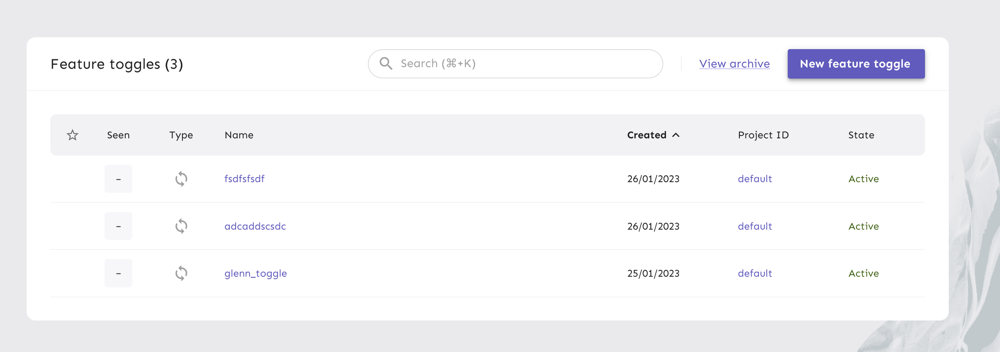

# Introduction to feature management with Unleash.io

Welcome to this lab exercise where we will explore feature management using Unleash.

## Overview

In this lab, we will have a play with AWS Comprehend and feature toggles. Please spend some time to read about the different 
services and tools used in this lab 

### AWS Comprehend 

Amazon Comprehend is an AWS service that offers powerful natural language processing (NLP) capabilities. It enables
businesses to analyze and extract valuable insights from unstructured text data, such as customer reviews, social media
content, and documents. With features like sentiment analysis, named entity recognition, and language detection, AWS
Comprehend helps businesses understand and harness the information contained within textual content.

Sentiment analysis, a key feature of AWS Comprehend, allows businesses to automatically determine the emotional tone and
polarity of text, classifying it as positive, negative, neutral, or mixed. By gauging the sentiment expressed in
customer feedback, reviews, or social media posts, organizations can swiftly grasp public sentiment about their products
or services, facilitating data-driven decision-making and proactive engagement with their audience. This feature is a
valuable tool for monitoring and understanding customer opinions, improving brand reputation, and enhancing user
experiences.

### AWS Lambda

AWS Lambda is a serverless computing service that allows developers to run code without provisioning or managing servers. It automatically scales applications by running code in response to triggers such as changes in data, HTTP requests, or even specific system events. Lambda functions are event-driven and can be written in various programming languages, including Python, Node.js, Java, and more. With AWS Lambda, users are only charged for the compute time they consume, making it a cost-effective option for executing small, on-demand functions without maintaining dedicated server infrastructure. It's commonly used for microservices architectures, data processing, and automating cloud operations.

### AWS SAM 

AWS Serverless Application Model (AWS SAM) is an open-source framework designed to simplify the development, deployment, and management of serverless applications on AWS. It extends AWS CloudFormation to provide a simplified syntax for defining serverless resources, such as AWS Lambda functions, API Gateway endpoints, DynamoDB tables, and more. With SAM, developers can easily define and deploy complex serverless applications in a declarative template, manage configurations, and package their code for deployment. SAM also includes the AWS SAM CLI, which allows for local testing and debugging of serverless applications, making it a powerful tool for both development and operational efficiency. By streamlining the creation of serverless resources, AWS SAM enables rapid iteration and seamless integration with other AWS services.

### Unleash.io

Unleash is an open-source feature management platform that enables developers to control the release of features in their applications using feature toggles. It allows for the gradual rollout of new features, enabling teams to enable or disable them without deploying new code. This helps reduce risks during deployment, improve testing, and provide a more flexible development process. Unleash supports various toggle strategies, such as user-specific, gradual rollouts, or environment-based toggles, allowing for fine-grained control over which users or environments see new features. This makes it ideal for continuous delivery and A/B testing scenarios.

## Lab intro

In this lab you will

* Use the Unleash UI to create a feature toggle
* Utilize AWS Cloud 9, a web-based development environment, to build and run an AWS Lambda function
* Observe how we can switch the toggle on or off and observe the resulting responses
* If the feature toggle is enabled, it will pass the request body to AWS Comprehend
* If the feature toggle is disabled, it will return a mock result of positive, with no confidence score
* We will deploy the Lambda function and test the API endpoint

Observe the effects of setting the toggle on or off by viewing the results in our browser.

## Create a toggle in unleash io



Register for the Unleash environment with an email address you can confirm
[https://eu.app.unleash-hosted.com/eubb1043/new-user?invite=2693d43e14a2324f42584023ef79f60d](https://eu.app.unleash-hosted.com/eubb1043/new-user?invite=2693d43e14a2324f42584023ef79f60d)

Then ... 

* Log in to your Unleash dashboard. Link will be given in the classroom.
* Click on the "Default" Project
* Click on the "New Feature Flag" button.
* Enter a name for the feature toggle, including your name to avoid naming conflicts (e.g. glenn_toggle)
* Choose the "Release" toggle type.
* Leave the remaining values as their default.
* Click on the "Create Feature Toggle" button.
* On the main feature flag page, under the section "Enabled in environments", enable the flag for the "Development" environment


## Log in to your AWS Cloud9  environment

Go to the AWS Management Console (https://244530008913.signin.aws.amazon.com/console)

* Enter your username - password and username will be given in class
* Click on the "Sign In" button.
* Once you are logged in, you will be directed to the AWS Management Console home page.
* In the top left corner, you will see a navigation menu. Click on the "Services" button.
* In the services menu, look for the "Cloud9" service.
* Click on the Cloud9 service to open the Cloud9 dashboard.
* You will now be able to see the list of environments that you have access to.
* !If you don't see any environments, make sure the selected region is eu-west-1
* Select your Cloud9 environment, select the "Open" Link
* Familiarize yourself with Cloud9 by exploring and experimenting with the platform.

## Install jq 

jq is a small command line tool that makes parsing and displaying json better in a terminal. Run the command from the Cloud9 Terminal 

```
sudo yum install -y jq 
```

## No auto save!

The number #1 problem for most students using Cloud9 is that they forget to explicitly save files - as there is no auto
save!

## Clone this repo

Clone this repository into your cloud 9 environment. Use the Terminal on the bottom of the screen in your cloud 9
environment

```text
git clone https://github.com/glennbechdevops/unleash-feature-management
```

## Add an Unleash token to your template.yml file

On the left side in the Cloud9 IDE, there is a file browser. Now that this repository is cloned, you'll see a folder
with the name  ```unleash-feature-management```

Add an unleash token to the code

The token will be given in class, and should be added to this segment of template.yml file

````text
    Properties:
      CodeUri: hello_world/
      Handler: app.lambda_handler
      Runtime: python3.9
      Environment:
        Variables:
          UNLEASH_API_TOKEN: <insert token here>
      Architectures:
````

Also, in the folder hello_world, there is a file ```app.py``` - You need to change the following line to use your own
feature toggle

```shell
    if client.is_enabled('glenn_toggle'):
```

## Build and run the Lambda function locally

```shell
cd unleash-feature-management/
sam build --use-container
sam local invoke -e event.json
```

The event.json file looks very comprehensive! But it's actually just how an HTTP request is passed from the API Client to the Lambda function 
through the AWS Service called API Gateway. Find the "body" element in the file to try out different text

The response might look like something like this;
```text
END RequestId: 5e84abaf-fc32-4d50-86f8-4219764c8d5e
REPORT RequestId: 5e84abaf-fc32-4d50-86f8-4219764c8d5e  Init Duration: 0.14 ms  Duration: 1151.45 ms    Billed Duration: 1152 ms        Memory Size: 512 MB     Max Memory Used: 512 MB
{"statusCode": 200, "headers": {"Content-Type": "application/json"}, "body": "{\"sentiment\": \"positive\", \"confidence\": 0.9991305470466614}"}
```

Try to toggle your feature on and off,  When the toggle is off, the lambda should return positive sentiment, but with no confidence
When enabled, it should return 200 ok

## Deploy the lambda to AWS

```shell
sam deploy --guided
```

Please note that you do not need to provide the "guided" flag after the first deployment has been done. During the
deployment process, provide the following input, but use your *own name* in the stack name.

```
Setting default arguments for 'sam deploy'
=========================================
Stack Name [sam-app]: your name or something 
AWS Region [eu-west-1]:
#Shows you resources changes to be deployed and require a 'Y' to initiate deploy
Confirm changes before deploy [y/N]: N
#SAM needs permission to be able to create roles to connect to the resources in your template
Allow SAM CLI IAM role creation [Y/n]: Y
#Preserves the state of previously provisioned resources when an operation fails
Disable rollback [y/N]: N
HelloWorldFunction may not have authorization defined, Is this okay? [y/N]: Y
Save arguments to configuration file [Y/n]: Y
SAM configuration file [samconfig.toml]:
SAM configuration environment [default]:
```

This will take some time, and when it is done - the Endpoint given to your lambda will be displayed - something like
this (Just an example)

```shell
Key                 HelloWorldApi                                                                                                                                                                                                         
Description         API Gateway endpoint URL for Prod stage for Hello World function                                                                                                                                                      
Value               https://6ztkdjfii8.execute-api.eu-west-1.amazonaws.com/Prod/hello/    
```

The lambda function is deployed with the domain name / URL given by *value* in your output.

If you have Postman installed, or another API client - the URL should be similar to this `https://26gfk7hsl6.execute-api.eu-west-1.amazonaws.com/Prod/sentiment` 
Warning! please note that there should be `/Prod/sentiment`, sometimes SAM outputs `/Prod/Hello`in the output
The method is POST, and the BODY should be a RAW text

You can test the API with `curl` from the Terminal window in Cloud9 

```
URL=<url from output of SAM deploy>
curl -X POST $URL  -H "Content-Type: application/json" -d 'Sharknado is an absolute disaster, and not in the fun, campy way you might expect. The plot is absurd, and not in a clever or entertaining way, The CGI is laughably bad, with the sharks looking more like floating clip art than any real threat.' | jq
```

## Set a Randomized 50% rollout strategy for the toggle 

* Go to the Unleash UI and find your toggle.
* Find the development environment and click the "strategy" button
* Change to Randomized stickyness - and 50% 
* 


# Bonus challenge;

* Try different settings for the toggle (percentage, sticky randomness etc) 
* Look at the documentation for the comprehend client and https://boto3.amazonaws.com/v1/documentation/api/latest/reference/services/comprehend.html
* Can you add more functionality, How about detect_dominant_language? Keyword extraction or entity detection.  
* Explore the Unleash IO and see if you can create a gradual roll-out strategy for your toggle!
* Explore the Python SDK for unleash https://docs.getunleash.io/reference/sdks/python
