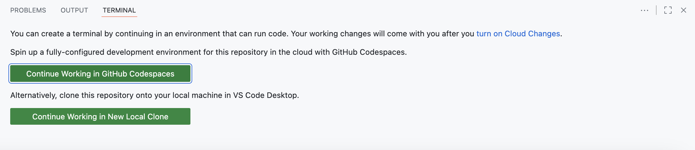

# Introduction to feature management with Unleash.io

Welcome to this lab exercise where we will explore feature management using Unleash.

## Overview

In this lab, we will have a play with AWS Comprehend and feature toggles. Please spend some time to read about the different 
services and tools used in this lab 

### AWS Comprehend 

Amazon Comprehend is an AWS service that offers powerful natural language processing (NLP) capabilities. It enables
businesses to analyze and extract valuable insights from unstructured text data, such as customer reviews, social media
content, and documents. With features like sentiment analysis, named entity recognition, and language detection, AWS
Comprehend helps businesses understand and harness the information contained within textual content.

Sentiment analysis, a key feature of AWS Comprehend, allows businesses to automatically determine the emotional tone and
polarity of text, classifying it as positive, negative, neutral, or mixed. By gauging the sentiment expressed in
customer feedback, reviews, or social media posts, organizations can swiftly grasp public sentiment about their products
or services, facilitating data-driven decision-making and proactive engagement with their audience. This feature is a
valuable tool for monitoring and understanding customer opinions, improving brand reputation, and enhancing user
experiences.

### AWS Lambda

AWS Lambda is a serverless computing service that allows developers to run code without provisioning or managing servers. It automatically scales applications by running code in response to triggers such as changes in data, HTTP requests, or even specific system events. Lambda functions are event-driven and can be written in various programming languages, including Python, Node.js, Java, and more. With AWS Lambda, users are only charged for the compute time they consume, making it a cost-effective option for executing small, on-demand functions without maintaining dedicated server infrastructure. It's commonly used for microservices architectures, data processing, and automating cloud operations.

### AWS SAM 

AWS Serverless Application Model (AWS SAM) is an open-source framework designed to simplify the development, deployment, and management of serverless applications on AWS. It extends AWS CloudFormation to provide a simplified syntax for defining serverless resources, such as AWS Lambda functions, API Gateway endpoints, DynamoDB tables, and more. With SAM, developers can easily define and deploy complex serverless applications in a declarative template, manage configurations, and package their code for deployment. SAM also includes the AWS SAM CLI, which allows for local testing and debugging of serverless applications, making it a powerful tool for both development and operational efficiency. By streamlining the creation of serverless resources, AWS SAM enables rapid iteration and seamless integration with other AWS services.

### Unleash.io

Unleash is an open-source feature management platform that enables developers to control the release of features in their applications using feature toggles. It allows for the gradual rollout of new features, enabling teams to enable or disable them without deploying new code. This helps reduce risks during deployment, improve testing, and provide a more flexible development process. Unleash supports various toggle strategies, such as user-specific, gradual rollouts, or environment-based toggles, allowing for fine-grained control over which users or environments see new features. This makes it ideal for continuous delivery and A/B testing scenarios.

## Lab intro

In this lab you will

* Use the Unleash UI to create a feature toggle
* Utilize GitHub Codespaces, a cloud-based development environment, to build and run an AWS Lambda function
* Observe how we can switch the toggle on or off and observe the resulting responses
* If the feature toggle is enabled, it will pass the request body to AWS Comprehend
* If the feature toggle is disabled, it will return a mock result of positive, with no confidence score
* We will deploy the Lambda function and test the API endpoint

Observe the effects of setting the toggle on or off by viewing the results in our browser.

## Create a toggle in unleash.io

The unleash instance is running at
https://eu.app.unleash-hosted.com/eubb1043/

* Log into Unleash with credentials given in the class. 
* You might also have been given an invite code. 
* Please remind your instructor that your user will need "Editor" or "Admin" access. He frequeltly forgets to do this!

When in the Unleash UI

* Click on the "Default" Project
* Click on the "New Feature Flag" button.
* Enter a name for the feature toggle, including your name to avoid naming conflicts (e.g. glenn_toggle)
* Choose the "Release" toggle type.
* Leave the remaining values as their default.
* Click on the "Create Feature Flag" button.
* On the main feature flag page, enable the flag for the "Development" environment


## Set up your GitHub Codespace

* Fork this repository to your own GitHub account by clicking the "Fork" button in the top right corner of the GitHub page
* Once forked, navigate to your forked repository
* Click the green "Code" button and select the "Codespaces" tab
* Click "Create codespace on main" to launch your development environment

* Wait for the Codespace to initialize - this may take a minute or two
* Once ready, you'll have a fully configured VS Code environment in your browser
* Familiarize yourself with Codespaces by exploring the interface - it works just like VS Code!


## Terminal 

* You will need to create a Terminal in your codespace, when asked, chose the "Continue working in codespaces"

The terminal is available at the bottom of the screen in your Codespace (if you don't see it, go to `Terminal > New Terminal` from the menu).

When you enable the terminal, GitHub Codespaces might have to do more initialization. Grab a coffee!



## Add an Unleash token to your template.yml file

On the left side in the Codespace, there is a file browser (Explorer) where you can see all the files in the repository.

Add an unleash token to the code

The token will be given in class, and should be added to this segment of template.yml file

````text
    Properties:
      CodeUri: hello_world/
      Handler: app.lambda_handler
      Runtime: python3.9
      Environment:
        Variables:
          UNLEASH_API_TOKEN: "TOKEN"
      Architectures:
````

Also, in the `hello_world` folder, there is a file `app.py` - You need to change the following line to use your own feature toggle

```shell
    if client.is_enabled('glenn_toggle'):
```

## Configure AWS Credentials

Before you can build and run the Lambda function, you need to configure your AWS credentials. These will be provided to you in the classroom.

Open the terminal in your Codespace and run:

```shell
aws configure
```

You will be prompted to enter the following information:

```
AWS Access Key ID [None]: <enter the access key provided in class>
AWS Secret Access Key [None]: <enter the secret key provided in class>
Default region name [None]: eu-west-1
Default output format [None]: json
```

This configuration is necessary for:
* Running the Lambda function locally with AWS Comprehend
* Deploying the Lambda function to AWS

You can verify your configuration by running:

```shell
aws sts get-caller-identity
```

## Build and run the Lambda function locally

Important! Before going forward, make sure you understand the logic of the Lambda function. It uses the toggle to decide whether to:

* Return a mock response for the sentiment analysis
* Call the AWS comprehend service to do a proper sentiment analysis

Open the terminal in your Codespace and run:

```shell
sam build --use-container
sam local invoke -e event.json
```

The event.json file looks very comprehensive! But it's actually just how an HTTP request is passed from the API Client to the Lambda function through the AWS Service called API Gateway. Find the "body" element in the file to try out different text

The response might look like something like this;
```text
END RequestId: 5e84abaf-fc32-4d50-86f8-4219764c8d5e
REPORT RequestId: 5e84abaf-fc32-4d50-86f8-4219764c8d5e  Init Duration: 0.14 ms  Duration: 1151.45 ms    Billed Duration: 1152 ms        Memory Size: 512 MB     Max Memory Used: 512 MB
{"statusCode": 200, "headers": {"Content-Type": "application/json"}, "body": "{\"sentiment\": \"positive\", \"confidence\": 0.9991305470466614}"}
```

*What exactly am I looking at?* The JSON you see here is a result of the AWS Comprehend service's sentiment analysis on the text given in the HTTP request body. Is it positive? Is it negative, or neutral? 

Play around with it, change the body. How Positive can you get? Puppies and cake?

Try to toggle your feature on and off,  When the toggle is off, the lambda should return positive sentiment, but with no confidence
When enabled, it should return 200 ok


Depending on what you want to focus on - AWS deployment of your function, feature toggles and so on, please feel free to pick any of the bonus challenges. 

## Bonus: Deploy the lambda to AWS

```shell
sam deploy --guided
```

Please note that you do not need to provide the "guided" flag after the first deployment has been done. During the
deployment process, provide the following input, but use your *own name* in the stack name.

```
Setting default arguments for 'sam deploy'
=========================================
Stack Name [sam-app]: your name or something 
AWS Region [eu-west-1]:
#Shows you resources changes to be deployed and require a 'Y' to initiate deploy
Confirm changes before deploy [y/N]: N
#SAM needs permission to be able to create roles to connect to the resources in your template
Allow SAM CLI IAM role creation [Y/n]: Y
#Preserves the state of previously provisioned resources when an operation fails
Disable rollback [y/N]: N
HelloWorldFunction may not have authorization defined, Is this okay? [y/N]: Y
Save arguments to configuration file [Y/n]: Y
SAM configuration file [samconfig.toml]:
SAM configuration environment [default]:
```

This will take some time, and when it is done - the Endpoint given to your lambda will be displayed - something like
this (Just an example)

```shell
Key                 HelloWorldApi                                                                                                                                                                                                         
Description         API Gateway endpoint URL for Prod stage for Hello World function                                                                                                                                                      
Value               https://6ztkdjfii8.execute-api.eu-west-1.amazonaws.com/Prod/hello/    
```

The lambda function is deployed with the domain name / URL given by *value* in your output.

If you have Postman installed, or another API client - the URL should be similar to this `https://26gfk7hsl6.execute-api.eu-west-1.amazonaws.com/Prod/sentiment` 

**Warning!** please note that there should be `/Prod/sentiment` in the URL, sometimes SAM outputs `/Prod/Hello`in the output
The method is POST, and the BODY should be a RAW text

You can test the API with `curl` from the terminal in your Codespace:

```bash
URL=<url from output of SAM deploy>
curl -X POST $URL  -H "Content-Type: application/json" -d 'Sharknado is an absolute disaster, and not in the fun, campy way you might expect. The plot is absurd, and not in a clever or entertaining way, The CGI is laughably bad, with the sharks looking more like floating clip art than any real threat.' | jq
```

## Bonus: Set a Randomized 50% rollout strategy for the toggle 

* Go to the Unleash UI and find your toggle.
* Find the development environment and click the "strategy" button
* Change to Randomized stickyness - and 50% 
* Observe that the toggle will evaluate to true- in about 50% of the lambda invocations
  


# More bonus challenges:

* Try different settings for the toggle (percentage, sticky randomness etc) 
* Look at the documentation for the comprehend client and https://boto3.amazonaws.com/v1/documentation/api/latest/reference/services/comprehend.html
* Can you add more functionality, How about detect_dominant_language? Keyword extraction, Toxic language- or entity detection.  
* Explore the Unleash IO and see if you can create a gradual roll-out strategy for your toggle!
* Explore the Python SDK for unleash https://docs.getunleash.io/reference/sdks/python
